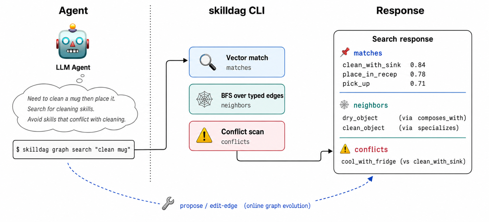

# SkillDAG

**SkillDAG: Self-Evolving Typed Skill Graphs for LLM Skill Selection at Scale**

Open-source reproduction repository for the paper. Citation metadata is currently a placeholder and will be updated after the public paper record is available.



## What is SkillDAG?

As LLM agents adopt large skill libraries, selecting the right subset becomes a structural problem rather than a similarity-matching one: skills depend on, conflict with, specialize, or duplicate one another — a structure invisible to both full enumeration and embedding similarity.

**SkillDAG** models inter-skill relationships as a typed directed graph and exposes it to an LLM agent as an inference-time, agent-callable structural retrieval interface:

- `search` returns vector matches, typed-edge neighbors, and conflict signals
- `propose-edge` / `edit-edge` let the agent register execution-backed edges
- The graph accumulates structure across episodes

## What is in this repo

- `src/skilldag/` — SkillDAG library and CLI
- `scripts/` — setup, data download, benchmark launchers, replay tools
- `benchmarks/` — ALFWorld + SkillsBench integration code
- `analysis/` — scoring and post-hoc analysis helpers
- `docs/reproducing.md` — fresh-clone walkthrough
- `artifacts/expected/` — expected paper-aligned metrics for verification

## Prerequisites

- Python ≥ 3.10 (python3.11 recommended)
- Docker (for SkillsBench tasks)
- `gettext` (for `envsubst`) — `brew install gettext` on macOS, `apt install gettext-base` on Debian/Ubuntu
- An OpenAI-compatible chat API key

**SkillsBench** also requires installing the Harbor framework first. See `docs/reproducing.md`.

**ALFWorld** also requires running `alfworld-download` once to populate `ALFWORLD_DATA` (configured in `.env`).

## Quickstart

```bash
git clone https://github.com/Ericbai06/SkillDAG.git
cd SkillDAG
bash scripts/prepare_env.sh
# fill API keys in .env
bash scripts/setup.sh
```

## Benchmark Commands

### SkillsBench (200 tasks)

```bash
SKILLDAG_SCALE=200 SKILLDAG_WORKERS=3 bash scripts/run_skillsbench.sh
```

### ALFWorld (10 games)

```bash
MAX_GAMES=10 bash scripts/run_alfworld.sh
```

### Paper-scale runs

```bash
SKILLDAG_SCALE=1000 SKILLDAG_WORKERS=5 bash scripts/run_skillsbench.sh
bash scripts/run_alfworld.sh
bash scripts/run_alfworld_traintest.sh
```

## Verification

See:

- `docs/reproducing.md`
- `REPRODUCIBILITY_CHECKLIST.md`

## Citation

Citation metadata is currently a placeholder and will be updated after the public paper record is available.

```bibtex
@misc{skilldag_placeholder,
  title={SkillDAG: Self-Evolving Typed Skill Graphs for LLM Skill Selection at Scale},
  author={SkillDAG Authors},
  year={2026},
  note={Citation placeholder}
}
```

## License

MIT